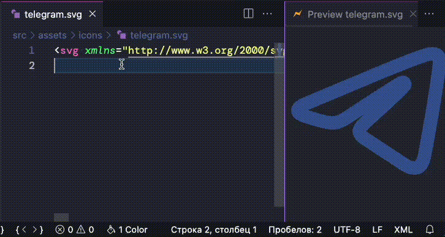
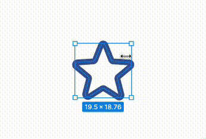
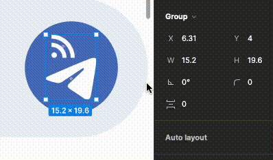
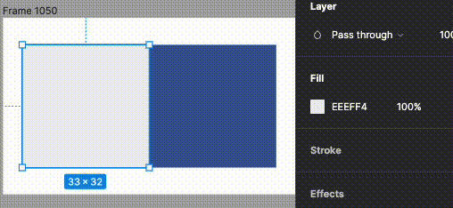

# Передача дизайна макета в Figma для верстальщиков
 
## Outline Stroke
Иконкам и прочим элементам, которые будут в SVG надо делать Outline Stroke (CMD + Shift + O). Так как иконки в режиме Stroke создают следующие проблемы:

- Неправильный реднер размера при рендере браузером
- Неправильные границы иконки из за того, что линии идут от центра вектора
- Невозможно менять цвет из css

Невозможно закрашивание иконок через свойство fill, так как у всех иконок удаляются (fill="none") для добавления их в спрайты, а у stroke версии path параметр цвета задается через stroke="#FF00FF"

Также надо сразу делать outline stroke, чтобы проверить вектор, он может быть неверным, из за чего произойдет искажение иконки

 
## Snap to Pixel Grid
Использовать в Figma привязку к пиксельной сетке Snap to Pixel Grid
Это решит проблему неправильного позиционирования элементов их отступов или размеров

 
## Использовать шаг пикселей в четном значении
- Отступы не могут быть 3px, 5px и тд только кратные 2px
- Контейнеры для иконок 8/16/24/32/48, в идеале иметь базовый набор в 24px и уже их изменять
 
## Цвета с использованием альфа канала
Например есть primary цвет, если нужно в дизайне сделать тусклый цвет от primary, достаточно добавить прозрачность в 10%, так как цвета задаются в переменные и если primary цвет изменится остальные цвета менять не придется

